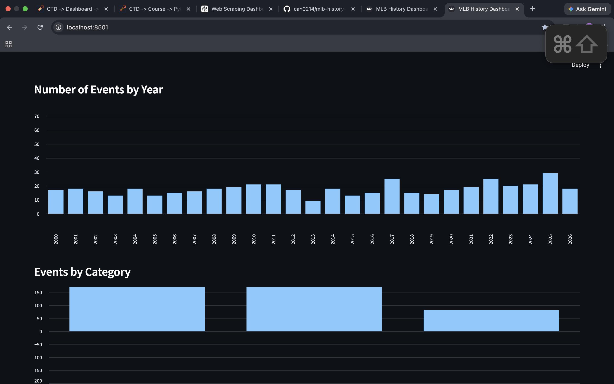
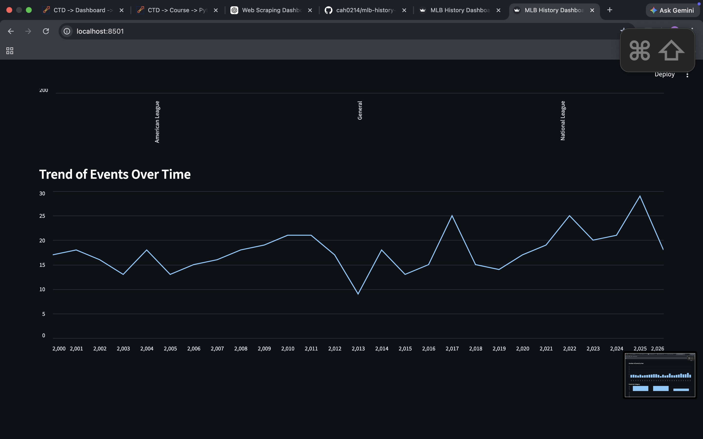

# MLB History Dashboard ⚾

This project scrapes historical Major League Baseball (MLB) event data from the Baseball Almanac website and presents insights through an interactive dashboard.

The project demonstrates the full data pipeline:

- Web scraping using Selenium
- Data cleaning and transformation using Pandas
- Data storage in a SQLite database
- SQL queries using joins
- Interactive data visualization using Streamlit

---

## Data Source

Data was scraped from:

https://www.baseball-almanac.com/yearmenu.shtml

This site provides historical MLB events and statistics organized by year.

---

## Project Structure

## Installation

Clone the repository:

git clone https://github.com/cah0214/mlb-history-dashboard.git
cd mlb-history-dashboard

Create and activate a virtual environment:

python -m venv .venv
source .venv/bin/activate

Install dependencies:

pip install -r requirements.txt

---

## Dashboard Features

The dashboard allows users to explore MLB historical events interactively.

Users can:

- Select a specific year
- Adjust a year range filter
- Search event descriptions
- View visualizations of MLB historical trends

Visualizations include:

- Events by year
- Events by category
- Event trends over time

---

## Dashboard Preview

---

## Technologies Used

- Python
- Selenium
- Pandas
- SQLite
- Streamlit

---

## Author

Crystal Hoefener
